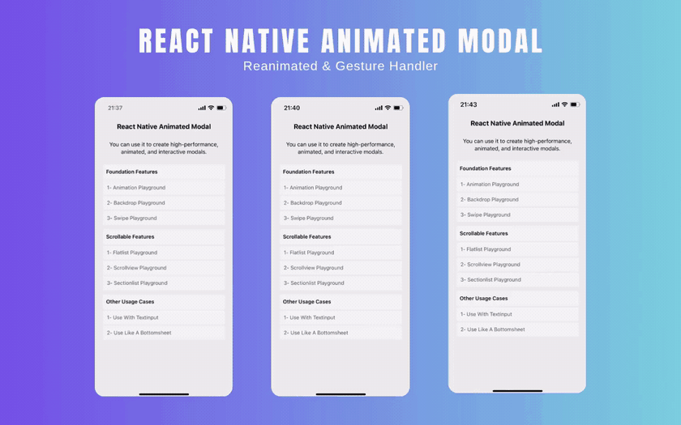

A **highly customizable** React Native modal component. Perfect for mobile applications, this modal enhances user experience by combining fluid animations with gesture-friendly controls.

For full API documentation and usage examples, check out the [📖 ONLINE DOCS](https://hyoper.github.io/react-native-animated-modal/).

## ✨ Features
- **Smooth animations** are provided with [Reanimated](https://docs.swmansion.com/react-native-reanimated/).
- **Smooth gestures** are provided with [Gesture Handler](https://docs.swmansion.com/react-native-gesture-handler/).
- Interactive and customizable **backdrop**.
- Synchronous pan gestures for **scrollable child** components.

---

## ⚙️ Requirements
This package relies on specific versions of its **peer dependencies** to function correctly. Make sure your project meets the following requirements:

```json
{
  "react": ">=18.2.0",
  "react-native": ">=0.78.0",
  "react-native-gesture-handler": ">=2.26.0",
  "react-native-reanimated": ">=3.19.0"
}
```

## 🧩 Example
A simple example of the component's usage is provided below. You can easily **customize it** to fit your project needs.

For more complete examples and real-world use cases, check out the [📂 EXAMPLE FOLDER](https://github.com/HyopeR/react-native-animated-modal/tree/master/example).

```typescript jsx
import React, {useState} from 'react';
import {StyleSheet, Text, View} from 'react-native';
import {Modal} from 'react-native-animated-modal';

const Example = () => {
  const [visible, setVisible] = useState(false);
  return (
    <Modal
      // Modal status is hidden or visible.
      visible={visible}
      // Use Fade/Scale/Slide animations. (Optional)
      animation={{
        type: 'slide',
        direction: {start: 'up', end: 'down'},
        duration: 350,
      }}
      // Activate and customize the draggable modal. (Optional)
      swipe={{
        enabled: true,
        directions: ['up', 'down', 'left', 'right'],
        distance: 120,
        velocity: 800,
        closable: true,
      }}
      // Customize the backdrop component. (Optional)
      backdrop={{
        enabled: true,
        backgroundColor: 'black',
        opacity: 0.5,
      }}
      // Triggered when the modal is closed.
      onHide={() => setVisible(false)}
      // Triggered when the modal is opened. (Optional)
      onShow={() => {}}
      // Triggered when the android back button is pressed. (Optional)
      onBackPress={() => setVisible(false)}
      // Triggered when the backdrop is pressed. (Optional)
      onBackdropPress={() => setVisible(false)}
      // Triggered when the drag operation is completed. (Optional)
      onSwipeComplete={() => setVisible(false)}
      // Triggered when the drag operation is canceled. (Optional)
      onSwipeCancel={() => {}}>
      <View style={styles.content}>
        <Text>React Native Animated Modal</Text>
      </View>
    </Modal>
  );
};

const styles = StyleSheet.create({
  content: {
    width: 320,
    height: 240,
    backgroundColor: 'white',
    padding: 20,
    borderRadius: 15,
    alignItems: 'center',
    justifyContent: 'center',
  },
});
```

## 📜 Scrollables
Use **Scrollable components** to handle pan gestures **in parallel** for the Modal and its child components.

- **Scrollable (Wrapper)** – [Show](https://hyoper.github.io/react-native-animated-modal/functions/Scrollable.html)
- **ScrollableFlatList (Child)** – [Show](https://hyoper.github.io/react-native-animated-modal/variables/ScrollableFlatList.html)
- **ScrollableSectionList (Child)** – [Show](https://hyoper.github.io/react-native-animated-modal/variables/ScrollableSectionList.html)
- **ScrollableView (Child)** – [Show](https://hyoper.github.io/react-native-animated-modal/variables/ScrollableView.html)

```typescript jsx
import React, {useState} from 'react';
import {StyleSheet, Text, View} from 'react-native';
import {Modal, Scrollable, ScrollableFlatList} from 'react-native-animated-modal';

const Example = () => {
  const [visible, setVisible] = useState(false);
  return (
    <Modal
      visible={visible}
      swipe={{enabled: true, directions: ['up', 'down', 'left', 'right']}}
      onSwipeComplete={() => setVisible(false)}
      onHide={() => setVisible(false)}>
      <View style={styles.content}>
        <Scrollable
          // Determine the orientation of the list. (Optional)
          orientation={'vertical'}
          // Determine whether the list should be reversed. (Optional)
          inverted={false}
          // Listen to the list's callbacks. (Optional)
          onScroll={() => {}}
          onBeginDrag={() => {}}
          onEndDrag={() => {}}
          onMomentumBegin={() => {}}
          onMomentumEnd={() => {}}>
          {options => {
            return (
              <ScrollableFlatList
                {...options}
                data={Array.from({length: 20}, (_, i) => i + 1)}
                keyExtractor={item => item.toString()}
                renderItem={({item}) => (
                  <View style={styles.item}>
                    <Text style={styles.itemText}>Item: {item}</Text>
                  </View>
                )}
              />
            );
          }}
        </Scrollable>
      </View>
    </Modal>
  );
};

const styles = StyleSheet.create({
  content: {
    width: 320,
    height: 240,
    backgroundColor: 'white',
    padding: 20,
    borderRadius: 15,
    alignItems: 'center',
    justifyContent: 'center',
  },
  item: {
    backgroundColor: '#F4F4F4',
    padding: 10,
    marginBottom: 8,
    marginHorizontal: 4,
  },
  itemText: {
    fontSize: 16,
    color: '#333',
  },
});
```
